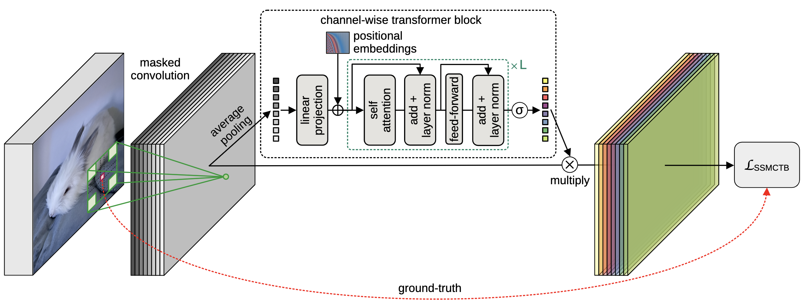
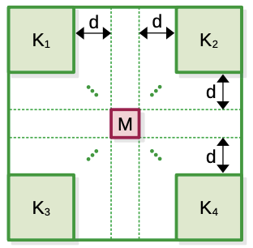

#  Self-Supervised Masked Convolutional Transformer Block for Anomaly Detection (official repository)                                                                                  

We propose to integrate the reconstruction-based functionality into a novel self-supervised masked convolutional transformer block. 
The proposed self-supervised block is generic and can easily be incorporated into various state-of-the-art anomaly detection methods.

The open-access paper can be found at: http://arxiv.org/abs/2209.12148

This code is released under the [CC BY-NC-SA 4.0](https://creativecommons.org/licenses/by-nc-sa/4.0/) license.

-----------------------------------------



-----------------------------------------                                                                                                                                      
## Information

Our kernel is illustrated in the picture below.  The visible area of the receptive field is denoted by the regions Ki, ∀i ∈ {1, 2, 3, 4},
while the masked area is denoted by M. A dilation factor d controls the local or global nature of the visible information with respect to M.




## Implementation

We provide implementation for both PyTorch and Tensorflow in the ``torch_ssmctb.py``, ``torch_ssmctb_3d.py`` and ``tf_ssmctb.py`` scripts.

> In order to work properly, you need to have a python version newer than 3.6
> (we used the python 3.6.8 version).


## Related Projects
[SSPCAB](https://github.com/ristea/sspcab) |
[vit-pytorch](https://github.com/lucidrains/vit-pytorch) <br>


## Citation

If you use our block in your own work, please don't forget to cite us:

```
@inproceedings{Madan-ARXIV-2022,
  title={Self-Supervised Masked Convolutional Transformer Block for Anomaly Detection},
  author={Madan, Neelu and Ristea, Nicolae-Catalin and Ionescu, Radu Tudor and Nasrollahi, Kamal and Khan, Fahad Shahbaz and Moeslund, Thomas B and Shah, Mubarak},
  booktitle={ARXIV},
  year={2022}
}
```

## Feedback

You can send your questions or suggestions to:

r.catalin196@yahoo.ro, raducu.ionescu@gmail.com


